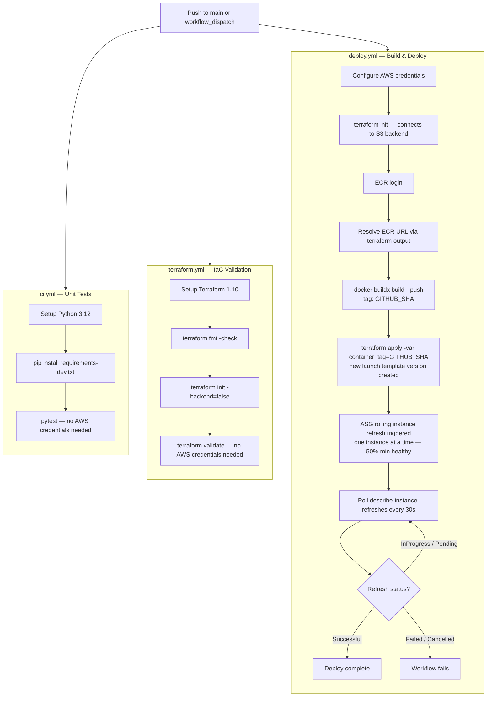

# Loadsmart SRE challenge — ALB management API

Python service implementing [`swagger-file.yaml`](../swagger-file.yaml) (OpenAPI 2.0): `GET /healthcheck` (public), and `GET|POST|DELETE /elb/{elbName}` protected by HTTP Basic auth, backed by **Application Load Balancer (ELBv2)** APIs against the **first target group** attached to the named load balancer.

## Test locally

### 1. Automated tests (no AWS)

Run from the **`sre-api/`** directory (not the git repo root — that is where `requirements-dev.txt` lives):

```bash
cd sre-api
python3 -m venv .venv && source .venv/bin/activate
pip install -r requirements-dev.txt
pytest
```

These use a fake ELB layer; **no** `AWS_*` variables are required.

### 2. Run the API on your machine

Same venv; set API auth and (for real ELB calls) AWS credentials the same way as the CLI (`~/.aws/credentials`, or env vars):

```bash
export API_BASIC_USER=admin API_BASIC_PASSWORD=changeme
export AWS_DEFAULT_REGION=us-east-1
# Optional if not using ~/.aws (use your own keys — do not commit them):
# export AWS_ACCESS_KEY_ID=...
# export AWS_SECRET_ACCESS_KEY=...
# export AWS_SESSION_TOKEN=...   # only for temporary credentials

uvicorn src.main:app --host 0.0.0.0 --port 8080
```

Examples:

```bash
curl -i -u admin:changeme http://127.0.0.1:8080/healthcheck
curl -s -u admin:changeme "http://127.0.0.1:8080/elb/default-alb"
```

- **`/healthcheck`** is a **public** endpoint — no auth required.
- **`/elb/...`** requires Basic auth and calls AWS; your principal needs ELBv2 + `ec2:DescribeInstances` (same family of permissions as the EC2 instance role in Terraform).

### 3. Docker Compose

`docker compose up --build` maps **8080→8080**. AWS credentials are passed via environment variables. Export them before running:

```bash
export AWS_DEFAULT_REGION=us-east-1
export AWS_ACCESS_KEY_ID=...
export AWS_SECRET_ACCESS_KEY=...
export API_BASIC_USER=admin
export API_BASIC_PASSWORD=changeme
docker compose up --build
```

Credentials are read by boto3 at runtime from the container's environment.

## Container

```bash
docker build -t sre-api:local .
docker run --rm -p 8080:8080 \
  -e AWS_DEFAULT_REGION=us-east-1 \
  -e API_BASIC_USER=admin \
  -e API_BASIC_PASSWORD=changeme \
  -e AWS_ACCESS_KEY_ID \
  -e AWS_SECRET_ACCESS_KEY \
  sre-api:local
```

The process listens on **port 8080** inside the container (non-root user cannot bind port 80). On EC2 the host maps `80 → 8080`; the ALB target group still targets instance port 80.

## AWS deploy (Terraform)

Infra lives in `terraform/`. Resource names follow:

**`<terraform.workspace>-<product>[-suffix]`**

`product` is defined in code (`terraform/locals.tf` → `challenge`). The **first segment** is the **Terraform workspace** name, e.g. `development` → `development-challenge-api`, `development-challenge-alb`. Resource tags still include `Environment`, which is set to the workspace name.

- **Networking (dedicated, not default VPC):** VPC, Internet Gateway, `public_subnet_count` **public** subnets for the ALB + matching **private** subnets for compute (default `10.0.1–2.0/24` public, `10.0.11–12.0/24` private). A **NAT Gateway** in the first public subnet provides outbound internet access (ECR pulls) from the private subnets.
- **ALB:** name defaults to **`default-alb`** (required by the challenge). Spans all public subnets. HTTP redirects to HTTPS when `domain_name` is set.
- Target group (HTTP on 80) with health check on **`/healthcheck`**; matcher `200` (public endpoint, no credentials needed). `deregistration_delay = 30s`.
- **Auto Scaling Group:** desired 2, min 1, max 4 — instances in private subnets across AZs. CPU target-tracking policy (60%). Rolling instance refresh on every deploy (min 50% healthy).
- ECR repository **`{prefix}-api`** (tag-**immutable**; SHA tags only)
- IAM instance profile: ECR pull + ELBv2 describe/register/deregister + `ec2:DescribeInstances` + SSM Session Manager (`AmazonSSMManagedInstanceCore`)
- **Optional HTTPS:** set `domain_name = "api.example.com"` in `terraform.tfvars` to create an ACM certificate (DNS validation) and an HTTPS listener on port 443.

### Workspaces

```bash
cd terraform
terraform workspace new development   # once
terraform workspace select development
terraform plan
```

Without selecting a workspace you stay on **`default`**, so names look like **`default-challenge-...`**.

### Test Terraform (without apply)

From `terraform/`:

```bash
terraform fmt -check -recursive   # optional
terraform init -backend=false
terraform validate
```

`validate` does not call AWS. For a real diff you need credentials and then: `terraform init && terraform plan -var-file=terraform.tfvars`.

### Remote state (S3)

**S3** holds state. Workspace isolation uses `workspace_key_prefix` (state keys like `s3://<bucket>/workspace/<workspace>/...`). This repo uses **S3-native locking** via `use_lockfile = true` in the backend block (no DynamoDB table required; requires Terraform ≥ 1.10).

**1. Create the bucket** (once; name must match `terraform` → `backend "s3"` in **`main.tf`** — default: `loadsmart-sre-terraform-state`).

Important: if you paste multi-line commands, make sure you paste **all lines** (a trailing `\` only works when the next line is included). The one-liners below are safest.

```bash
export TF_STATE_BUCKET="loadsmart-sre-terraform-state"
export AWS_REGION="us-east-1"

# us-east-1: no LocationConstraint. Other regions: add
# --create-bucket-configuration LocationConstraint=$AWS_REGION
aws s3api create-bucket --bucket "$TF_STATE_BUCKET" --region "$AWS_REGION"

aws s3api put-bucket-versioning --bucket "$TF_STATE_BUCKET" --versioning-configuration Status=Enabled
```

**2. Backend** — Defined inline in **`terraform/main.tf`**. Edit `bucket`, `region`, or `use_lockfile` there if needed.

**3. Initialize**

```bash
cd terraform
terraform init
# If you already have local terraform.tfstate to upload:
# terraform init -migrate-state
```

**Local state only** (skip S3): `terraform init -backend=false` (matches CI).

### Terraform in CI/CD

| Piece | What you have |
|--------|----------------|
| **GitHub — `terraform.yml`** | On PR/push to `main` when `sre-api/terraform/**` changes: **`terraform fmt -check`**, **`init -backend=false`**, **`validate`**. No AWS credentials; safe on forks. |
| **App deploy — `deploy.yml`** | Builds Docker image, pushes to **ECR** (SHA tag), `terraform apply` → ASG rolling instance refresh. |

**Optional: `terraform plan` / `apply` in GitHub** (typical production pattern):

1. **Remote state** — **`backend "s3"`** is inline in **`terraform/main.tf`**. CI still runs **`init -backend=false`**, so **`terraform plan` in GitHub** needs a normal **`terraform init`** (with AWS access to the state bucket/table) plus credentials in that job.
2. **Auth** — GitHub **OIDC** → IAM role (preferred) or repository secrets for keys (narrow permissions; separate role for `plan` vs `apply`).
3. **Secrets / variables** — Pass sensitive `tfvars` via `TF_VAR_*` env vars from GitHub secrets, or a generated `*.auto.tfvars` in the job (never commit real `terraform.tfvars`).
4. **Apply** — Usually **`workflow_dispatch`**, **environment** with required reviewers, or only from a protected branch — avoid auto-apply on every merge unless policy allows.

For this repo, keeping **fmt + validate in CI** and running **plan/apply locally or from a guarded workflow** is the usual balance.

### Steps

1. Copy `terraform/terraform.tfvars.example` → `terraform/terraform.tfvars` and set credentials (do **not** commit real secrets).
2. `cd terraform && terraform init` (or `terraform init -backend=false` for local state only), then pick a workspace (see above).
3. `terraform apply`
4. Build and push the image, then apply again with the new tag:

   ```bash
   TAG=$(git rev-parse --short HEAD)
   ./scripts/build_and_push.sh $TAG
   terraform apply -var="container_tag=$TAG"
   ```

   ECR tags are immutable — always use a unique tag (git SHA). `terraform apply` updates the launch template version, which triggers an ASG rolling instance refresh automatically.

5. Hit `http://$(terraform output -raw alb_dns_name)/healthcheck` — no auth required.

Available outputs: `vpc_id`, `vpc_cidr`, `public_subnet_ids`, `private_subnet_ids`, `alb_name`, `alb_dns_name`, `ecr_repository_url`, `asg_name`, `target_group_arn`.

**Costs:** ALB (~$16/mo) + NAT Gateway (~$32/mo) are not Free Tier. Run `terraform destroy` when done.

**Layout:** `terraform/` contains flat `.tf` files: `network.tf`, `alb.tf`, `ec2.tf`, `ecr.tf`, `iam.tf`, `security_groups.tf`, `checks.tf`, `locals.tf`, `variables.tf`, `outputs.tf`. User-data template is `user-data.sh.tpl`.

## GitHub Actions

Workflows live in [`.github/workflows/`](../.github/workflows/).

| Workflow | When | What it does |
|----------|------|----------------|
| `ci.yml` | PR / push to `main` (paths under `sre-api/`) | `pytest` |
| `terraform.yml` | PR / push to `main` (paths under `sre-api/terraform/`) | `terraform fmt -check` → `init -backend=false` → `validate` |
| `deploy.yml` | Push to `main` (same paths) or **Run workflow** | Docker build → push to ECR (**SHA tag only**; ECR is IMMUTABLE) → `terraform apply` → ASG rolling refresh |



### Configure GitHub (deploy workflow)

**`deploy.yml`** uses **long-lived or temporary IAM user/access keys** via secrets (simplest to start). Create an IAM user (or role + assumed keys) whose policy allows:

- **ECR push:** `ecr:GetAuthorizationToken` on `*`; `ecr:BatchCheckLayerAvailability`, `ecr:CompleteLayerUpload`, `ecr:GetDownloadUrlForLayer`, `ecr:InitiateLayerUpload`, `ecr:PutImage`, `ecr:UploadLayerPart`, `ecr:BatchGetImage` on your repository ARN.
- **Terraform apply:** permissions to manage VPC, EC2, ELB, ECR, IAM, and Auto Scaling resources.

**Repository secrets**

| Secret | Required | Purpose |
|--------|----------|---------|
| `AWS_ACCESS_KEY_ID` | yes | IAM access key |
| `AWS_SECRET_ACCESS_KEY` | yes | IAM secret key |
| `API_BASIC_USER` | yes | Passed to Terraform as `TF_VAR_api_basic_user` |
| `API_BASIC_PASSWORD` | yes | Passed to Terraform as `TF_VAR_api_basic_password` |

**Repository variables** *(optional)*

- `AWS_REGION` — defaults to `us-east-1` in the workflow if unset.
- `TF_WORKSPACE` — Terraform workspace to select (defaults to `dev`).

### Improvement: GitHub OIDC (no long-lived keys)

Prefer **OIDC** so GitHub assumes an IAM role and you never store access keys in secrets:

1. Create an IAM OIDC provider for `token.actions.githubusercontent.com` and a role with trust limited to your repo (e.g. `sub` like `repo:ORG/REPO:ref:refs/heads/main`).
2. Attach the ECR push + Terraform apply policy to that role.
3. In `deploy.yml`, replace the **Configure AWS** step with `role-to-assume: ${{ secrets.AWS_ROLE_ARN }}` and add top-level `permissions: id-token: write` (plus `contents: read`). Remove the access-key inputs from `configure-aws-credentials`.

Rotate or delete the IAM user keys once OIDC is working.

## API behavior notes

- **404** if no load balancer matches `elbName`.
- **409** on attach when the instance is already registered, or on detach when it is not.
- **400** for malformed JSON bodies (mapped from validation errors).
- **201** on successful attach/detach per the published spec.

## Deliverable zip

Include: `sre-api/` (this tree), `swagger-file.yaml`, and `SOLUTION.txt`. Exclude `.venv`, `terraform.tfvars`, and local Terraform state if it points at real infra.
